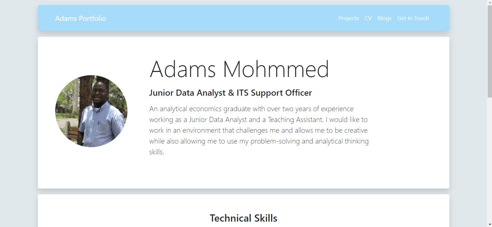

# Adams Portfolio Site

My Portfolio Site.

## Motivation

This project was set up to showcase my works, CV, Blogs and Contacts.

## Screenshot



## URL

[Todo List App with Typescript and Webpack]()

## Installation

1. Clone Repo
2. cd to the directory where cloned folder is locacted
3. run: npm install in your shell

```bash
npm install
```

## Tech/framework used

1. HTML5
2. CSS3
3. Bootstrap 5
4. SASS
5. JavaScript

## License

[MIT](https://choosealicense.com/licenses/mit/)
